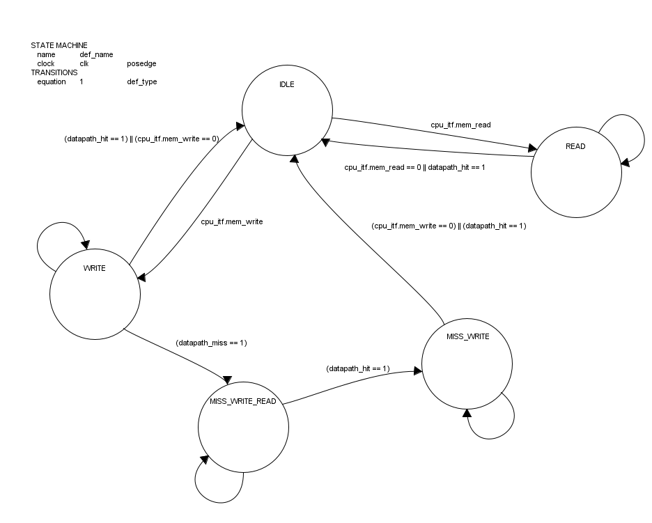
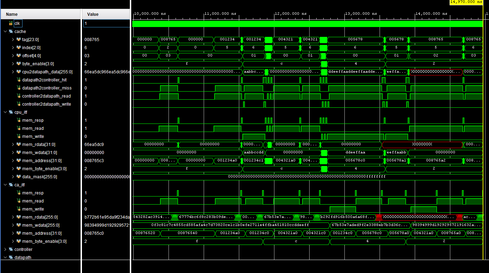

# CPE 333 -- Lab #2: Caches
### Dylan Leifer-Ives


## Summary

---
### Overview
In this lab a cache for the RISC-V Otter was implemented. It took the form of a one-level, unifed, 2-way set associate cache.

The cache was developed in the following specfic order:
 - Cacheline adaptor (to convert from "main memory" to the cachelines that the cache understands)
 - Memory Architechure (such that 2 cycle reads and writes are possible on cache hits)
 - Cache Datapath (to handle the cache's read and write operations)
 - Cache Controller (to handle the cache's control signals)
 - Cache (to tie everything together)

This was to ensure that the cache could be tested at each stage of development.
Specific tests were written for each stage of development to ensure that the cache was functioning as expected.
Then the given cache testbench was used to test the cache as a whole.
---
### Cacheline Adaptor
The cacheline adaptor was the first module developed. It was responsible for converting the memory interface of the cache to the memory interface of the main memory. This was done by reading from the cache line and converting it to the form to be written to main memory, and vice versa. The module was implemented as a state machine with 5 states: IDLE, READ_MEMORY, FINISH_READ, WRITE_MEMORY, and WAIT_WRITE. The module was tested by running a series of TCL commands. And by a modified test bench 

Reading was implemented first since it was a simpler problem to break down into steps. This is a theme that was consistent throughout the lab report since, as the lab progressed, the problems became more complex and required more steps to solve.

```systemverilog 
module cacheline_adaptor
(
    mem_itf.device ca_itf,
    mem_itf.controller pmem_itf
);
// TWO MAIN TASKS
// Store
// 1. Read from the cache line and convert to the form to be written to main memory then do so
// Load
// 2. Read from main memory and convert to the form to be written to the cache line then do so
    localparam int CACHE_LINE_SIZE = 256;
    localparam int WORD_SIZE = 32;
    localparam int WORDS_PER_CACHE_LINE = CACHE_LINE_SIZE / WORD_SIZE;

    // buffer to store the words from the cache line
    logic [WORD_SIZE-1:0] word_buffer[WORDS_PER_CACHE_LINE-1:0];
    // buffer to store the cache line
    logic [CACHE_LINE_SIZE-1:0] cache_line_buffer;

    // controls
    logic load_complete = 1;
    logic store_complete = 1;
    logic [WORD_SIZE-1:0] word_buffer_index;
    logic [WORD_SIZE-1:0] cache_line_buffer_index;
    logic read_word = 1;

	typedef enum logic [2:0] {
			IDLE = 3'd0,
			READ_MEMORY = 3'd1,
			FINISH_READ = 3'd2,
			WRITE_MEMORY = 3'd3,
			WAIT_WRITE = 3'd4
		} state_t;


	state_t state, next_state;

	// state machine
	always_ff @(posedge ca_itf.clk or posedge ca_itf.rst) begin
		if (ca_itf.rst) begin
			state <= IDLE;
			for(int i = 0; i < WORDS_PER_CACHE_LINE; i++) begin
				word_buffer[i] <= 'h0;
			end
			cache_line_buffer <= 'h0;
			load_complete <= 1;
			store_complete <= 1;
			word_buffer_index <= 0;
			cache_line_buffer_index <= 0;
			read_word <= 1;
		end else begin
			state <= next_state;
		end
	end

	// state machine logic
	always_comb begin
	    		next_state = state;
		case (state)
			IDLE: begin
				if (ca_itf.mem_read) begin
					next_state = READ_MEMORY;
				end else if (ca_itf.mem_write) begin
					next_state = WRITE_MEMORY;
				end
			end
			READ_MEMORY: begin
				if (load_complete) begin
					next_state = FINISH_READ;
				end
			end
			FINISH_READ: begin
				if (!load_complete) begin
					next_state = FINISH_READ;
				end else if (load_complete) begin
					next_state = IDLE;
				end
			end
			WRITE_MEMORY: begin
				if (store_complete) begin
					next_state = WAIT_WRITE;
				end
			end
			WAIT_WRITE: begin
				if (!store_complete) begin
					next_state = WAIT_WRITE;
				end else if (store_complete) begin
					next_state = IDLE;
				end
			end
		endcase
	end

	always_ff @(posedge ca_itf.clk or posedge ca_itf.rst) begin
		if (ca_itf.rst) begin
			load_complete <= 1;
			store_complete <= 1;
			word_buffer_index <= 0;
			cache_line_buffer_index <= 0;
			cache_line_buffer <= 'h0;
			
			for (int i = 0; i < WORDS_PER_CACHE_LINE; i++) begin
				word_buffer[i] <= 'h0;
			end
		end else begin
			case (state)
				READ_MEMORY: begin
					load_complete <= 0;
					cache_line_buffer_index <= 0;
					cache_line_buffer <= 'h0;
					pmem_itf.mem_address <= ca_itf.mem_address;
					pmem_itf.mem_read <= 1;
				end
				FINISH_READ: begin
				    if (pmem_itf.mem_resp) begin
						ca_itf.mem_rdata[cache_line_buffer_index*WORD_SIZE +: WORD_SIZE] <= pmem_itf.mem_rdata;
						pmem_itf.mem_byte_enable <= 4'b1111;
						if (cache_line_buffer_index == WORDS_PER_CACHE_LINE-1) begin
							load_complete <= 1;
							ca_itf.mem_resp <= 1;
							pmem_itf.mem_read <= 0;
							//ca_itf.mem_rdata <= cache_line_buffer;
						end
						cache_line_buffer_index <= cache_line_buffer_index + 1;
					end
				end
				WRITE_MEMORY: begin
					store_complete <= 0;
					word_buffer_index <= 1;
					for (int i = 0; i < WORDS_PER_CACHE_LINE; i++) begin
						word_buffer[i] <= ca_itf.mem_wdata[i*WORD_SIZE +: WORD_SIZE];
					end
					pmem_itf.mem_address <= ca_itf.mem_address;
					pmem_itf.mem_write <= 1;
					pmem_itf.mem_wdata <= ca_itf.mem_wdata[0 +: WORD_SIZE];
				end
				WAIT_WRITE: begin
				    if(pmem_itf.mem_resp) begin
				    	pmem_itf.mem_wdata <= word_buffer[word_buffer_index];
				    	pmem_itf.mem_byte_enable <= 4'b1111;
				    	word_buffer_index <= word_buffer_index + 1;
				    	if (word_buffer_index == WORDS_PER_CACHE_LINE) begin
				    		store_complete <= 1;
				    		ca_itf.mem_resp <= 1;
				    		pmem_itf.mem_write <= 0;
				    	end

				    end
				end
				IDLE: begin
					ca_itf.mem_resp <= 0;
					load_complete <= 1;
					store_complete <= 1;
					word_buffer_index <= 0;
					cache_line_buffer_index <= 0;
					cache_line_buffer <= 'h0;
				end
			endcase
		end
	end
 

endmodule : cacheline_adaptor
```
The memory test bench is as follows:
``` systemverilog
$display("%s==== (checking invalid tag match) Read, cold-start miss (allocate, block now valid and clean) ==================", DISPLAY_TIME ? $sformatf("%t: ", $time) : "");
        //read_dcache('h00000, 'h00, 'h0);
        ##50;

		pmem_itf.mem_address = '0; //'Z;
        pmem_itf.mem_wdata = '0; //'Z;
        pmem_itf.mem_write = '0;
        pmem_itf.mem_read = '0;
        pmem_itf.mem_byte_enable ='0;
         ##50;
		pmem_itf.mem_address = 'h00000000;
		pmem_itf.mem_wdata = 'h0;
		pmem_itf.mem_write = 1;
		##50;
		@(pmem_itf.mem_resp);
		// now read the same address
		pmem_itf.mem_address = 'h00000000;
		pmem_itf.mem_wdata = 'h0;
		pmem_itf.mem_write = 0;
		pmem_itf.mem_rdata = 'h999;
		##50;
		pmem_itf.mem_read = 1;
		##50;
		$display("%s[CPU] read addr=%x ", DISPLAY_TIME ? $sformatf("%t: ", $time) : "",pmem_itf.mem_address);
		$display("%s[CPU] read data=%x ", DISPLAY_TIME ? $sformatf("%t: ", $time) : "",pmem_itf.mem_rdata);
        $display("%s================ DONE ==========================================================================================", DISPLAY_TIME ? $sformatf("%t: ", $time) : "");
        ##50;
        
        
        
        ca_itf.rst = 1;
        memory._mem['h00000000] = 'h13034532c7e5f97b670c05dea9c9564efec775ff55a9dd724a0a1c2147591908;
        ##50;
        ca_itf.rst = 0;
        // start cacheline_adaptor testing
        ca_itf.mem_address = '0; //'Z;
        ca_itf.mem_wdata = '0; //'Z;
        ca_itf.mem_write = '0;
        ca_itf.mem_read = '0;
        ca_itf.mem_resp = '0;
        ca_itf.mem_rdata = '0;
        ##50;
        ca_itf.mem_address = 'h00000000;
        ca_itf.mem_read = 1;
        @(ca_itf.mem_resp);
        ca_itf.mem_read = 0;
        $display("%s[CPU] read addr=%x ", DISPLAY_TIME ? $sformatf("%t: ", $time) : "",ca_itf.mem_address);
        ##50

        ca_itf.mem_address = 'h00000000;
        ca_itf.mem_wdata = 'h13034532c7e5f97b670c05dea9c9564efec775ff55a9dd724a0a1c214759BEEF;
        ca_itf.mem_write = 1;
        @(ca_itf.mem_resp);
        ca_itf.mem_write = 0;
        $display("%s[CPU] write addr=%x ", DISPLAY_TIME ? $sformatf("%t: ", $time) : "",ca_itf.mem_address);
        ##50;
		/// show memory._mem['h00000000]
		$display("%s[CPU] read data=%x ", DISPLAY_TIME ? $sformatf("%t: ", $time) : "",memory._mem['h00000000]);
		
        ##50;
        itf.mem_address = 'h11;
        ##50;
        itf.mem_read = 1;
        itf.mem_byte_enable = 4'b1111;
        ##50;```
```
---
### Memory Architecture and Cache Datapath
The memory architecture of the RISV-V otter is a basic 32 bit memory that is byte accessable. To make the design more modular the memory for the cache is implemented as flat and packed values that are split to be accesssed.

This gets implemented in the cache datapath module as follows:
``` systemverilog
// valid bit way 1 and 2
    logic[num_sets-1:0] valid1, valid2;
// dirty bit way 1 and 2
    logic[num_sets-1:0] dirty1, dirty2;
// tag way 1 and 2 with size of s_tag for each set
    logic[s_tag-1:0] tag1[0:num_sets-1];
    logic[s_tag-1:0] tag2[0:num_sets-1];
// data way 1 and 2 with size of s_line for each set
    logic[s_line-1:0] data1[0:num_sets-1];
    logic[s_line-1:0] data2[0:num_sets-1];
// LRU way 1 and 2
    logic[num_sets-1:0] lru1, lru2;

    logic[s_line-1:0] data_mask;
    logic[s_line-1:0] cpu_write_data_mask;
```

Since there are only two ways in the cache the way to find the least recently used (lru) cache line is implemented as a single bit for each set. Such that to find the least recently used way the lru bit is checked to be high. And then the values for the lru will be swapped the other way. 

To validate that the cache line is proper and can be used the valid bit is checked as well as the tag being matched. 

``` systemverilog
/* MODIFY. The cache datapath. It contains the data,
valid, dirty, tag, and LRU arrays, comparators, muxes,
logic gates and other supporting logic. */

module cache_datapath#(
    parameter s_offset=5,
    parameter s_index=3,
    parameter s_tag=32-s_offset-s_index,
    parameter s_mask=2**s_offset,
    parameter s_line=8*s_mask,
    parameter num_sets=2**s_index
)
    (
        mem_itf.device cpu_itf,
        mem_itf.controller ca_itf,
        input logic clk,
        input logic rst,
        input logic[s_tag-1:0] addr_tag,
        input logic[s_index-1:0] addr_index,
        input logic[s_offset-1:0] addr_offset,
        input logic[s_line-1:0] data_in,
        input logic cpu_resp,

        input logic read,
        input logic write,
        output logic[s_line-1:0] data_out,
        output logic miss,
        output logic hit

    );
    localparam TAG_MSB = 32-1;
    localparam TAG_LSB = s_offset+s_index;
    localparam INDEX_MSB = s_offset+s_index-1;
    localparam INDEX_LSB = s_offset;
    localparam OFFSET_MSB = s_offset-1;
    localparam OFFSET_LSB = 0;
	
	//  State machine states
    typedef enum logic[1:0]{
        IDLE = 2'b00,
        WRITE_BACK = 2'b01,
        READ_MEM = 2'b10,
        PRE_READ_MEM = 2'b11
    } state_t;

    state_t state;

// valid bit way 1 and 2
    logic[num_sets-1:0] valid1, valid2;
// dirty bit way 1 and 2
    logic[num_sets-1:0] dirty1, dirty2;
// tag way 1 and 2 with size of s_tag for each set
    logic[s_tag-1:0] tag1[0:num_sets-1];
    logic[s_tag-1:0] tag2[0:num_sets-1];
// data way 1 and 2 with size of s_line for each set
    logic[s_line-1:0] data1[0:num_sets-1];
    logic[s_line-1:0] data2[0:num_sets-1];
// LRU way 1 and 2
    logic[num_sets-1:0] lru1, lru2;

    logic[s_line-1:0] data_mask;
    logic[s_line-1:0] cpu_write_data_mask;
    // PASSED VERIFY MASK
    
    // Cache read and write logic
    always @(posedge clk or posedge rst) begin
        cpu_write_data_mask <= {{8{cpu_itf.mem_byte_enable[3]}},{8{cpu_itf.mem_byte_enable[2]}},{8{cpu_itf.mem_byte_enable[1]}},{8{cpu_itf.mem_byte_enable[0]}}} << addr_offset[4:2]*s_mask;
        data_mask <= {s_mask{1'b1}} << addr_offset[4:2]*s_mask;;
        if (rst) begin
            valid1 <= 0;
            valid2 <= 0;
            dirty1 <= 0;
            dirty2 <= 0;
            for (int i = 0; i < num_sets; i++) begin
                tag1[i] <= 0;
                tag2[i] <= 0;
                data1[i] <= 0;
                data2[i] <= 0;
            end

            lru1 <= 0;
            lru2 <= 0;
            state <= IDLE;

        end
        else begin
            case (state)
                IDLE: begin
                    if (read) begin

                        if (valid1[addr_index] && tag1[addr_index] == addr_tag) begin
                            hit <= 1;
                            miss <= 0;
                            // TODO VERIFY
                            cpu_itf.mem_rdata <= (data1[addr_index] & data_mask) >> addr_offset[4:2]*s_mask;
                            if(cpu_itf.mem_resp == 0 && cpu_resp == 0) begin
                                cpu_itf.mem_resp <= 1;
                            end
                                // update LRU
                            // set lru1[addr_index] to 0 and lru2[addr_index] to 1
                            lru1[addr_index] <= 0;
                            lru2[addr_index] <= 1;
                        end
                        else if (valid2[addr_index] && tag2[addr_index] == addr_tag) begin
                            hit <= 1;
                            miss <= 0;
                            // TODO VERIFY
                            cpu_itf.mem_rdata <= (data2[addr_index] & data_mask) >> addr_offset[4:2]*s_mask;
                            if(cpu_itf.mem_resp == 0 && cpu_resp == 0) begin
                                cpu_itf.mem_resp <= 1;
                            end

                            // update LRU
                            // set lru1[addr_index] to 1 and lru2[addr_index] to 0
                            lru1[addr_index] <= 1;
                            lru2[addr_index] <= 0;
                        end
                        else begin
                            hit <= 0;
                            miss <= 1;
                            // get the data from memory using ca_itf then update the cache
                            // TODO: X - LRU, 2 - writeback evict!, 3 -
                            if (lru1[addr_index] == 1) begin
                                if ((valid1[addr_index] == 1) && (dirty1[addr_index] == 1)) begin
                                    // writeback
                                    // TODO VERIFY
                                    state <= WRITE_BACK;
                                    ca_itf.mem_address <= {tag1[addr_index], addr_index, {s_offset{1'b0}}};
                                    ca_itf.mem_wdata <= data1[addr_index];
                                    ca_itf.mem_write <= 1;
                                    ca_itf.mem_byte_enable <= cpu_itf.mem_byte_enable;
                                    ca_itf.mem_read <= 0;
                                end else begin
                                    // otherwise just read in the data
                                    // update way 1
                                    // TODO VERIFY
                                    state <= READ_MEM;
                                    ca_itf.mem_address <= {addr_tag, addr_index, {s_offset{1'b0}}};
                                    ca_itf.mem_write <= 0;
                                    ca_itf.mem_read <= 1;
                                    ca_itf.mem_byte_enable <= cpu_itf.mem_byte_enable;
                                end

                            end
                            else begin
                                if ((valid2[addr_index] == 1) && (dirty2[addr_index] == 1)) begin
                                    // writeback
                                    // TODO VERIFY
                                    state <= WRITE_BACK;
                                    ca_itf.mem_address <= {tag2[addr_index], addr_index, {s_offset{1'b0}}};
                                    ca_itf.mem_wdata <= data2[addr_index];
                                    ca_itf.mem_write <= 1;
                                     ca_itf.mem_byte_enable <= cpu_itf.mem_byte_enable;
                                    ca_itf.mem_read <= 0;
                                end else begin
                                    // otherwise just read in the data
                                    // update way 2
                                    // TODO VERIFY
                                    state <= READ_MEM;
                                    ca_itf.mem_address <= {addr_tag, addr_index, {s_offset{1'b0}}};
                                    ca_itf.mem_write <= 0;
                                    ca_itf.mem_read <= 1;
                                end
                            end
                        end
                    end else if (write) begin
                        // todo add response
                        if (valid1[addr_index] && tag1[addr_index] == addr_tag) begin
                            hit <= 1;
                            miss <= 0;
                            data1[addr_index] <= (data_in & cpu_write_data_mask) | (data1[addr_index] & ~cpu_write_data_mask);
                            dirty1[addr_index] <= 1;
                            // update LRU
                            // set lru1[addr_index] to 0 and lru2[addr_index] to 1
                            lru1[addr_index] <= 0;
                            lru2[addr_index] <= 1;
                            if(cpu_itf.mem_resp == 0 && cpu_resp == 0) begin
                                cpu_itf.mem_resp <= 1;
                            end
                        end
                        else if (valid2[addr_index] && tag2[addr_index] == addr_tag) begin
                            hit <= 1;
                            miss <= 0;
                            data2[addr_index] <= (data_in & cpu_write_data_mask) | (data2[addr_index] & ~cpu_write_data_mask);
                            dirty2[addr_index] <= 1;
                            // update LRU
                            // set lru1[addr_index] to 1 and lru2[addr_index] to 0
                            lru1[addr_index] <= 1;
                            lru2[addr_index] <= 0;
                            if(cpu_itf.mem_resp == 0 && cpu_resp == 0) begin
                                cpu_itf.mem_resp <= 1;
                            end
                        end
                        else begin
                            hit <= 0;
                            miss <= 1;
                            // get the data from memory using ca_itf then update the cache
                            // TODO
                            // get the cache controller to read in the data, then try writing to it again!
                            // arguably this should be handled here, but I think it's better to keep the cache controller
                            // in in charge of this since it will be make debugging easier, and it's a more modular design
                        end
                    end else begin
                        hit <= 0;
                        miss <= 0;
                        cpu_itf.mem_resp <= 0;
                        ca_itf.mem_write <= 0;
                        ca_itf.mem_read <= 0;
                        
                    end
                end
                WRITE_BACK: begin
                    if (ca_itf.mem_resp) begin
                        state <= PRE_READ_MEM;
                        ca_itf.mem_address <= {addr_tag, addr_index, {s_offset{1'b0}}};
                        ca_itf.mem_write <= 0;
                        ca_itf.mem_read <= 1;
                    end
                end
                PRE_READ_MEM: begin
                    state <= READ_MEM;
                end
                READ_MEM: begin
                    if (ca_itf.mem_resp) begin
                        state <= IDLE;
                        // update the cache
                        if (lru1[addr_index] == 1) begin
                            valid1[addr_index] <= 1;
                            tag1[addr_index] <= addr_tag;
                            dirty1[addr_index] <= 0;
                            data1[addr_index] <= ca_itf.mem_rdata;
                            lru1[addr_index] <= 0;
                            lru2[addr_index] <= 1;

                            hit <= 1;
                            miss <= 0;
                            // TODO VERIFY
                            cpu_itf.mem_rdata <= (ca_itf.mem_rdata & data_mask) >> addr_offset[4:2]*s_mask;
                            if(cpu_itf.mem_resp == 0 && cpu_resp == 0) begin
                                cpu_itf.mem_resp <= 1;
                            end
                            ca_itf.mem_write <= 0;
                             ca_itf.mem_byte_enable <= cpu_itf.mem_byte_enable;
                            ca_itf.mem_read <= 0;
                        end
                        else begin
                            valid2[addr_index] <= 1;
                            tag2[addr_index] <= addr_tag;
                            dirty2[addr_index] <= 0;
                            data2[addr_index] <= ca_itf.mem_rdata;
                            lru1[addr_index] <= 1;
                            lru2[addr_index] <= 0;

                            hit <= 1;
                            miss <= 0;
                            // TODO VERIFY
                            cpu_itf.mem_rdata <= (ca_itf.mem_rdata & data_mask) >> addr_offset[4:2]*s_mask;
                            if(cpu_itf.mem_resp == 0 && cpu_resp == 0) begin
                                cpu_itf.mem_resp <= 1;
                            end
                            ca_itf.mem_write <= 0;
                             ca_itf.mem_byte_enable <= cpu_itf.mem_byte_enable;
                            ca_itf.mem_read <= 0;
                        end
                    end
                end
            endcase
        end
    end

endmodule : cache_datapath
```
### Cache Controller
This module essentailly allows the communication between the cache and the CPU. It is a state machine that controls the behaviour of the cache. At this point most of the program had been tested, and all the individual parts were working, so all that was left was to make it work with the cpu, and the testbench. There are 6 states that are used in the state machine. The states are as follows:
- IDLE: The default state of the cache controller. It waits for the CPU to send a request.
- READ: The state where the cache controller reads the data from the cache. Essentially it waits for the datapath to send a signal that the data has been read, and then closes the request response to the CPU.
- WRITE: The state where the cache controller writes the data to the cache. It waits for the datapath to send a signal that the data has been written, and then closes the request response to the CPU. However this WRITE also occurs when a WRITE is missed.
- MISS_WRITE_READ: This state essentailly handles the write back, where it will first read in the new memory, and then call the next state (MISS_WRITE), where the data is written into the newly read memory.
- MISS_WRITE: This state is a continuation of a missed write, where the data is written into the newly read memory.


```systemverilog
/* MODIFY. The cache controller. It is a state machine
that controls the behavior of the cache. */

module cache_control #(
    parameter s_offset = 5,
    parameter s_index  = 3,
    parameter s_tag    = 32 - s_offset - s_index,
    parameter s_mask   = 2**s_offset,
    parameter s_line   = 8*s_mask,
    parameter num_sets = 2**s_index
)
(
    mem_itf.device cpu_itf,
    mem_itf.controller ca_itf,
    // tag, index, and offset bits
    input logic datapath_hit,
    input logic datapath_miss,
    input logic [s_line-1:0] datapath_data,


    input logic [s_tag-1:0] tag,
    input logic [s_index-1:0] index,
    input logic [s_offset-1:0] offset,
    input logic [3:0] byte_enable,

    output logic datapath_read,
    output logic datapath_write,
    output logic no_cpu_resp
);
    localparam TAG_MSB = 32 - 1;
    localparam TAG_LSB = s_offset + s_index;
    localparam INDEX_MSB = s_offset + s_index -1;
    localparam INDEX_LSB = s_offset;
    localparam OFFSET_MSB = s_offset - 1;
    localparam OFFSET_LSB = 0;


    typedef enum logic [3:0] {
        IDLE,
        MISS_READ,
        MISS_WRITE,
        MISS_WRITE_READ,
        READ,
        WRITE
    } state_t;

    state_t state;

    always @(posedge cpu_itf.clk) begin
        if (cpu_itf.rst) begin
            state <= IDLE;
            datapath_read <= 0;
            datapath_write <= 0;
            no_cpu_resp <= 0;
        end else
        case (state)
            IDLE: begin
                no_cpu_resp <= 0;
                // disable things if they were on TODO
                // do nothing on no request
                if (~cpu_itf.mem_read && ~cpu_itf.mem_write) begin
                    state <= IDLE;
                end else if (cpu_itf.mem_read) begin
                    datapath_read <= 1;
                    state <= READ;
                end else if (cpu_itf.mem_write) begin
                    datapath_write <= 1;
                    state <= WRITE;
                end
            end
            READ: begin
                if (cpu_itf.mem_read == 0) begin
                    state <= IDLE;
                    datapath_read <= 0;
                end else if (datapath_hit == 1) begin
                    state <= IDLE;
                    cpu_itf.mem_resp <= 0;
                    // send the data back to the cpu
                    // TODO
                end else if (datapath_miss == 1) begin
                    state <= READ;
                end else begin
                    state <= READ;
                end
            end
            WRITE: begin
                if (cpu_itf.mem_write == 0) begin
                    state <= IDLE;
                    datapath_write <= 0;
                end else if (datapath_hit == 1) begin
                    state <= IDLE;
                    cpu_itf.mem_resp <= 0;
                    // send the data back to the cpu
                    // TODO
                end else if (datapath_miss == 1) begin
                    datapath_read <= 1;
                    datapath_write <= 0;
                    state <= MISS_WRITE_READ;
                    no_cpu_resp <= 1;
                end else begin
                    state <= WRITE;
                end
            end
            MISS_WRITE_READ: begin
                if (datapath_hit == 1) begin
                    state <= MISS_WRITE;
                    datapath_write <= 1;
                    datapath_read <= 0;
                    // send the data back to the cpu
                    // TODO
                end else if (datapath_miss == 1) begin
                    state <= MISS_WRITE_READ;
                end else begin
                    state <= MISS_WRITE_READ;
                end
            end
            MISS_WRITE: begin
                if (cpu_itf.mem_write == 0) begin
                    state <= IDLE;
                    datapath_write <= 0;
                    no_cpu_resp <= 0;
                end else if (datapath_hit == 1) begin
                    state <= IDLE;
                    cpu_itf.mem_resp <= 0;
                    no_cpu_resp <= 0;
                    // send the data back to the cpu
                    // TODO
                end else if (datapath_miss == 1) begin
                    state <= MISS_WRITE;
                end else begin
                    state <= MISS_WRITE;
                end
            end

        endcase
    end


endmodule : cache_control

```

### Cache 
The cache module is the top level module that connects the cache controller and the cache datapath. It also connects the cache to the CPU. It also, splits the address into the tag, index, and offset. The cache module also will reset the sub modules when the CPU is reset.

```systemverilog
/* MODIFY. Your cache design. It contains the cache
controller, cache datapath, and bus adapter. */

module cache #(
    parameter s_offset = 5,
    parameter s_index  = 3,
    parameter s_tag    = 32 - s_offset - s_index,
    parameter s_mask   = 2**s_offset,
    parameter s_line   = 8*s_mask,
    parameter num_sets = 2**s_index
)
(
    mem_itf.device cpu_itf,
    mem_itf.controller ca_itf

);
    localparam TAG_MSB = 32 - 1;
    localparam TAG_LSB = s_offset + s_index;
    localparam INDEX_MSB = s_offset + s_index -1;
    localparam INDEX_LSB = s_offset;
    localparam OFFSET_MSB = s_offset - 1;
    localparam OFFSET_LSB = 0;


    // tag
    logic [s_tag-1:0] tag;
    // index
    logic [s_index-1:0] index;
    // offset
    logic [s_offset-1:0] offset;
    // byte enable
    logic [3:0] byte_enable;

    logic [s_line-1:0]cpu2datapath_data;

    // always parse the address into tag, index, and offset
    assign tag = cpu_itf.mem_address[TAG_MSB:TAG_LSB];
    assign index = cpu_itf.mem_address[INDEX_MSB:INDEX_LSB];
    assign offset = cpu_itf.mem_address[OFFSET_MSB:OFFSET_LSB];
    assign byte_enable = cpu_itf.mem_byte_enable;
    // if cpu_itf.mem_read == 1 then set to{8{cpu_itf.mem_rdata}} else 0, if cpu_itf.mem_write == 1 then set to {8{cpu_itf.mem_wdata}}; else 0;
    assign cpu2datapath_data = (cpu_itf.mem_read == 1) ? {8{cpu_itf.mem_rdata}} : (cpu_itf.mem_write == 1) ? {8{cpu_itf.mem_wdata}} : 'h0;
    // extract the tag, index, and offset from the address

    // DATAPATH TO CONTROLLER SIGNALS
    logic datapath2controller_hit;
    logic dantrolletapath2controller_miss;
        logic [s_line-1:0] datapath2controller_data;
    
    // CONTROLLER TO DATAPATH SIGNALS
        logic controller2datapath_read;
        logic controller2datapath_write;
        logic cor2datapath_cpu_resp;
    
cache_control control(
    // INPUTS
    .cpu_itf(cpu_itf),
    .ca_itf(ca_itf),
    .datapath_hit(datapath2controller_hit),
    .datapath_miss(datapath2controller_miss),
    .datapath_data(datapath2controller_data),
    .tag(tag),
    .index(index),
    .offset(offset),
    .byte_enable(byte_enable),
    // OUTPUTS
    .datapath_read(controller2datapath_read),
    .datapath_write(controller2datapath_write),
    .no_cpu_resp(controller2datapath_cpu_resp)
);


cache_datapath datapath(
    // INPUTS
    .cpu_itf(cpu_itf),
    .ca_itf(ca_itf),
    .read(controller2datapath_read),
    .write(controller2datapath_write),
    .clk(cpu_itf.clk),
    .rst(cpu_itf.rst),
    .addr_tag(tag),
    .addr_index(index),
    .addr_offset(offset),
    .data_in(cpu2datapath_data),
    .cpu_resp(controller2datapath_cpu_resp),
    // OUTPUTS
    .hit(datapath2controller_hit),
    .miss(datapath2controller_miss),
    .data_out(datapath2controller_data)
);


    // on reset, reset the address dependent vaiables
    always @(posedge cpu_itf.rst) begin
        ca_itf.rst <= 1;
    end

    always @(posedge cpu_itf.clk) begin
        if(ca_itf.rst == 1) begin
            ca_itf.rst <= 0;
        end
    end

//Sample code to convert CPU bus requests (32-bit data) to cache signals (mostly 256-bit data)

//assign mem_wdata256 = {8{mem_wdata}};   	//Cache write data <-  from CPU wdata	
//assign mem_rdata = mem_rdata256[(32*address[4:2]) +: 32];		//CPU rdata <-  from cache line read (rdata256)
//assign mem_byte_enable256 = {28'h0, mem_byte_enable} << (address[4:2]*4);	//byte enable mask to data_arary in cache  //32bit Cache write enable <- 4-bit CPU strobe (byte enable)


endmodule : cache
```
## Verification

The verification of the cache is best provable using the provided test bench. 

The output of the test bench has no defined difference with the golden output.

The results of the test bench are as follows:

```
==== (checking invalid tag match) Read, cold-start miss (allocate, block now valid and clean) ==================
[CPU] read addr=00000000 
[Memory] Read started addr=00000000
[Memory] Read finished addr=00000000
[CPU] got data=47591908
================ Testing various cases, with delays between ====================================================
==== Read, cold-start miss (allocate, block now valid and clean) ===============================================
[CPU] read addr=00123420 
[Memory] Read started addr=00123420
[Memory] Read finished addr=00123420
[CPU] got data=0d6c646f
==== Write, cold-start miss (allocate then update, block now valid and dirty) ==================================
[CPU] write addr=00123441 with data=aabbccdd, strobe=f
[Memory] Read started addr=00123440
[Memory] Read finished addr=00123440
[CPU] write accepted
==== Read, hit, clean block (block still clean) ================================================================
[CPU] read addr=00123422 
[CPU] got data=0d6c646f
==== Read, hit, dirty block (block still dirty) ================================================================
[CPU] read addr=00123443 
[CPU] got data=aabbccdd
==== Read, conflict miss, clean block (allocate, block still clean) ============================================
[CPU] read addr=00432120 
[Memory] Read started addr=00432120
[Memory] Read finished addr=00432120
[CPU] got data=b68bdf25
==== Read, conflict miss, dirty block (write back then allocate, block now clean) ==============================
[CPU] read addr=00432141 
[Memory] Read started addr=00432140
[Memory] Read finished addr=00432140
[CPU] got data=8462b637
==== Write, hit, clean block (update, block now dirty) =========================================================
[CPU] write addr=00432122 with data=bbccddee, strobe=f
[CPU] write accepted
==== Write, hit, dirty block (update, block still dirty) =======================================================
[CPU] write addr=00432123 with data=ccddeeff, strobe=f
[CPU] write accepted
==== Write, conflict miss, clean block (allocate then update, block now dirty) =================================
[CPU] write addr=00567840 with data=ddeeffaa, strobe=f
[Memory] Write started addr=00123440
[Memory] Write finished addr=00123440
[Memory] Read started addr=00567840
[Memory] Read finished addr=00567840
[CPU] write accepted
==== Write, conflict miss, dirty block (write back then allocate then update, block still dirty) ===============
[CPU] write addr=00567821 with data=eeffaabb, strobe=f
[Memory] Read started addr=00567820
[Memory] Read finished addr=00567820
[CPU] write accepted
==== (verifying state) Read, conflict miss, dirty block (write back then allocate, block now clean) ============
[CPU] read addr=00876522 
[Memory] Write started addr=00432120
[Memory] Write finished addr=00432120
[Memory] Read started addr=00876520
[Memory] Read finished addr=00876520
[CPU] got data=98289334
==== (verifying state) Read, conflict miss, dirty block (write back then allocate, block now clean) ============
[CPU] read addr=00876543 
[Memory] Read started addr=00876540
[Memory] Read finished addr=00876540
[CPU] got data=512566b0
================ Testing various cases, with no delays between, and partial-word writes ========================
==== Read, cold-start miss (allocate, block now valid and clean) ===============================================
[CPU] read addr=001234a0 
[Memory] Read started addr=001234a0
[Memory] Read finished addr=001234a0
[CPU] got data=0bdbb521
==== Write, cold-start miss (allocate then update, block now valid and dirty) ==================================
[CPU] write addr=001234c1 with data=aabbccdd, strobe=c
[Memory] Read started addr=001234c0
[Memory] Read finished addr=001234c0
[CPU] write accepted
==== Read, hit, clean block (block still clean) ================================================================
[CPU] read addr=001234a2 
[CPU] got data=0bdbb521
==== Read, hit, dirty block (block still dirty) ================================================================
[CPU] read addr=001234c3 
[CPU] got data=aabbe7ca
==== Read, conflict miss, clean block (allocate, block still clean) ============================================
[CPU] read addr=004321a0 
[Memory] Read started addr=004321a0
[Memory] Read finished addr=004321a0
[CPU] got data=3025e5a2
==== Read, conflict miss, dirty block (write back then allocate, block now clean) ==============================
[CPU] read addr=004321c1 
[Memory] Read started addr=004321c0
[Memory] Read finished addr=004321c0
[CPU] got data=037df79d
==== Write, hit, clean block (update, block now dirty) =========================================================
[CPU] write addr=004321a2 with data=bbccddee, strobe=3
[CPU] write accepted
==== Write, hit, dirty block (update, block still dirty) =======================================================
[CPU] write addr=004321a3 with data=ccddeeff, strobe=8
[CPU] write accepted
==== Write, conflict miss, clean block (allocate then update, block now dirty) =================================
[CPU] write addr=005678c0 with data=ddeeffaa, strobe=4
[Memory] Write started addr=001234c0
[Memory] Write finished addr=001234c0
[Memory] Read started addr=005678c0
[Memory] Read finished addr=005678c0
[CPU] write accepted
==== Write, conflict miss, dirty block (write back then allocate then update, block still dirty) ===============
[CPU] write addr=005678a1 with data=eeffaabb, strobe=2
[Memory] Read started addr=005678a0
[Memory] Read finished addr=005678a0
[CPU] write accepted
==== (verifying state) Read, conflict miss, dirty block (write back then allocate, block now clean) ============
[CPU] read addr=008765a2 
[Memory] Write started addr=004321a0
[Memory] Write finished addr=004321a0
[Memory] Read started addr=008765a0
[Memory] Read finished addr=008765a0
[CPU] got data=92dd302a
==== (verifying state) Read, conflict miss, dirty block (write back then allocate, block now clean) ============
[CPU] read addr=008765c3 
[Memory] Read started addr=008765c0
[Memory] Read finished addr=008765c0
[CPU] got data=66ea5dc9
Stopped at time : 14970 ns : File "C:/school/CPE/333/LAB2/lab2_v3/cache_testbench_v2.sv" Line 161
```
The simulation waveform for the testbench is shown below as well:


